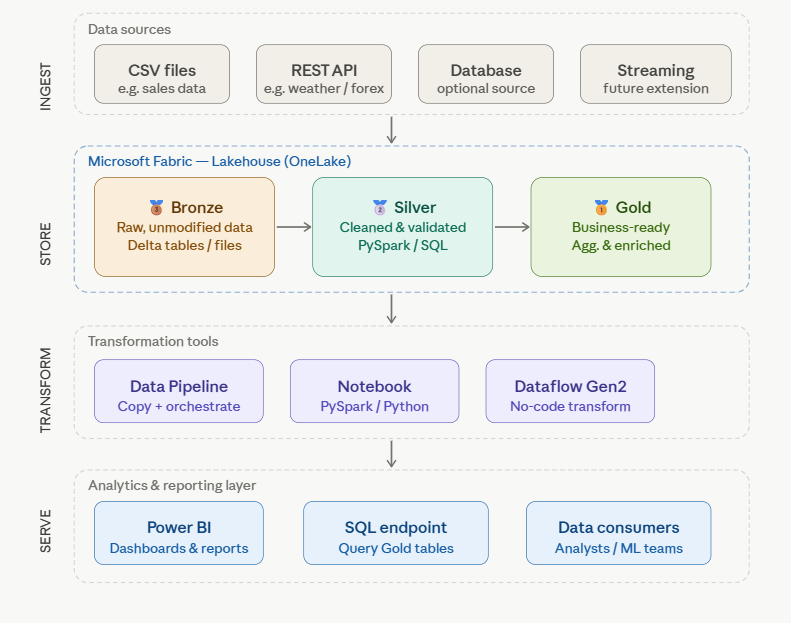
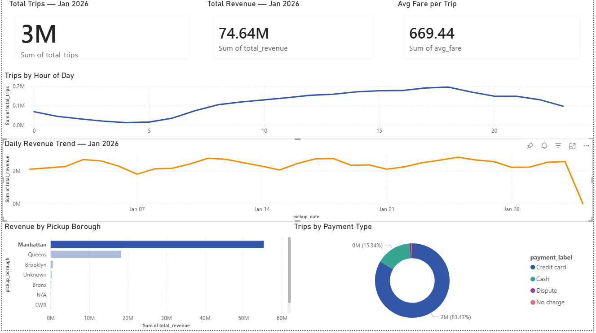

# NYC Yellow Taxi Data Pipeline — Microsoft Fabric

## Project overview
End-to-end data pipeline ingesting 2.9M+ NYC taxi trip records,
transforming raw data through a Bronze → Silver → Gold medallion
architecture, and serving business insights via a Power BI dashboard.

## Architecture

## Tech stack
| Tool | Purpose |
|---|---|
| Microsoft Fabric | Cloud data platform |
| OneLake / Lakehouse | Unified data storage |
| PySpark (Notebooks) | Data transformation |
| Delta Lake | ACID table format |
| SQL Analytics Endpoint | T-SQL querying |
| Power BI (DirectLake) | Dashboard & reporting |

## Medallion layers
- **Bronze** — Raw Parquet + CSV ingested via HTTP pipeline
- **Silver** — Cleaned, validated, enriched with zone names
- **Gold** — 4 aggregated business tables for analytics

## Key metrics from Jan 2024 data
- 2.9M+ trips processed
- ~150K–250K dirty records removed in Silver cleaning
- 4 Gold tables powering live Power BI dashboard

## Dashboard preview

## How to run
1. Create a Microsoft Fabric workspace
2. Create a Lakehouse named nyc_taxi_lakehouse
3. Run notebooks in order: ingest → silver → gold
4. Connect Power BI via SQL analytics endpoint

## What I learned
- Medallion architecture design for scalable data pipelines
- PySpark transformations and Delta Lake table management
- SQL window functions (RANK, SUM OVER) for analytics
- Power BI DirectLake mode for live-connected reporting
